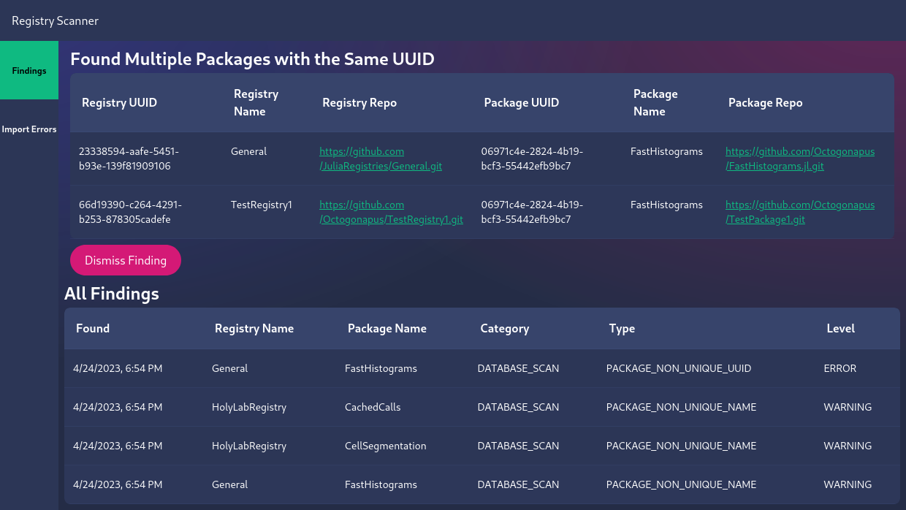

# RegistryScanner

Scans Julia registries for possible malicious behavior and misconfigurations.



- [RegistryScanner](#registryscanner)
  - [Capabilities](#capabilities)
  - [Deployment](#deployment)
    - [Configuration](#configuration)
    - [Alerts](#alerts)

## Capabilities

RegistryScanner can find and alert you about:

- Packages and pull requests introducing packages that use the same name and/or UUID as existing packages
- Packages that are configured with bare HTTP transport
- Registry modifications (e.g. packages that have had their URLs changed)
- Registry misconfigurations
  - Inconsistent package lists and registry contents
  - Duplicate packages

Currently, only GitHub registries are supported.

## Deployment

RegistryScanner comes with a [Docker compose file](./docker-compose.yaml) for easy deployment.
The compose file includes:

- The scanner backend
- A front end, which runs on [localhost:4000](http://localhost:4000)
- A database
- Grafana, which provides observability and runs on [localhost:3000](http://localhost:3000)
- Loki, which collects logs from the other services and can be accessed via Grafana

Loki requires a plugin:

```sh
docker plugin install grafana/loki-docker-driver:latest --alias loki --grant-all-permissions
```

RegistryScanner is at its core a service which runs continuously to scan registries and pull requests, generating findings which are inserted into a database.
This service can be deployed independently from the rest of the services specified in the compose file if you want.
All it needs is a database and some secrets for GitHub integration.
Look at the [compose file](./docker-compose.yaml) for more.

If you want to deploy RegistryScanner via Ansible, an [example playbook](./update-registry-scanner.yaml) has been included.
It expects this repository to be available at `../RegistryScanner`.
It also expects [registryscanner.service](./registryscanner.service) to be available at `files/registry-scanner/registryscanner.service`.

### Configuration

Modify the `REGISTRIES_TO_SCAN` environment variable in [docker-compose.yaml](./docker-compose.yaml).
Add all the public registries you use, along with any private registries you have.
Only GitHub registries are supported.

Create secrets where necessary.
All public registries can use the same secret; this secret only needs public repository scope.
Secrets for accessing private registries need private repository scope.
RegistryScanner uses GraphQL, so these secrets must be classic GitHub secrets; the new fine-grained secrets do not support GraphQL at this time.
A file named `github_token.txt` containing a personal access token is required by default, but this is configurable in the compose file.
Secret names in the `REGISTRIES_TO_SCAN` environment variable must be the same names as the entries under the `secrets:` block in the compose file.
View the default compose file to see how to add secrets.

Build and deploy:

```sh
docker build RegistryScanner -t registry-scanner:latest
docker build RegistryScannerUI -t registry-scanner-ui:latest
echo 'your_gh_token' > github_token.txt
docker compose up -d
```

The main UI runs on [localhost:4000](http://localhost:4000).

Grafana and Loki are available on [localhost:3000](http://localhost:3000).
View logs via Expore > Loki > `compose_service = scanner`.

### Alerts

Alerts are pre-configured, but delivery is not.
Configure the default contact point in Grafana with your preferred integration to receive these alerts.
